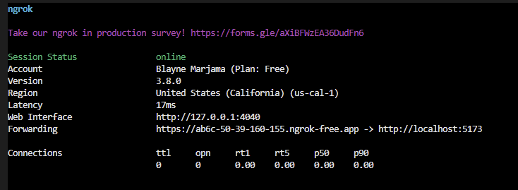
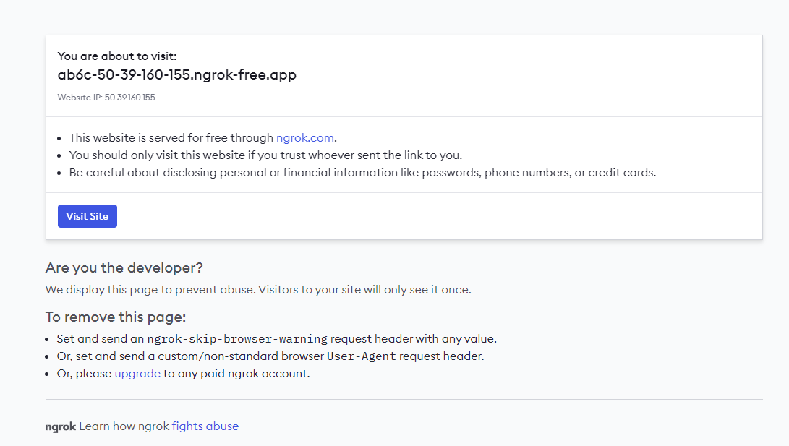

## Dev flow

### Rumble Frame Start
```bash
npm install
npm run dev
```

Head to http://localhost:5173/api

### Working with Farcaster Accounts Locally

If we do NOT need to verify anything with Farcaster accounts, we can continue developing locally. Otherwise, read on.

_Why_ do we need to work with Farcaster acocunts? We need to get the `fid` which we can then get the users verified eth address.

`hubs` in the frog initializer are what gets us the trusted data from the Farcaster network.

_Note: In the future we will not want to gate this app to Farcaster users only._

If you interact with the frame right now you'll notice that we either get errors, or the `verified` returns false.
In order to get this working locally, we need to set up `ngrok` which allows us to verify a users Farcaster id with their eth address.

### Setup Ngrok

Ngrok is a free tool. Just sign up, then follow the instructions to install it on your machine.

NOTE: Make sure Frog is running before starting `ngrok`!

1. Start the `ngrok` server

    ```bash
    ngrok http http://localhost:5173
    ```
    _Note: This should be the same port as the frame above._

2. After starting you will see a screen like below. 
    
    Click the "Forwarding" link, in this example ` https://ab6c-50-39-160-155.ngrok-free.app`
    

    2b. It will open a new browser window, where we click `Visit Site`, which will then reload and you will likely see a big empty screen. THIS IS FINE.
    

3. Visit `https://warpcast.com/~/developers/frames`, and input the Forwarding link from the step above. It should look something like this:
    